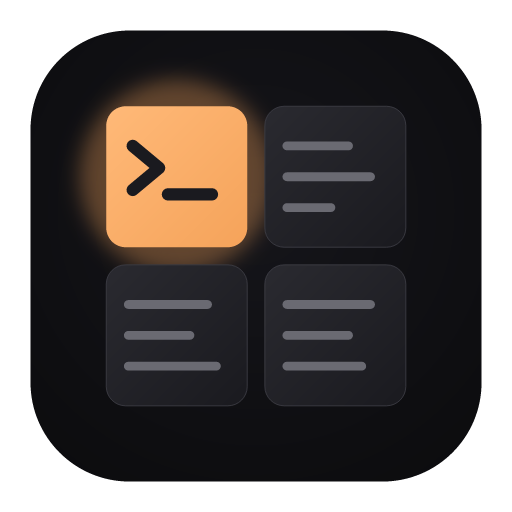
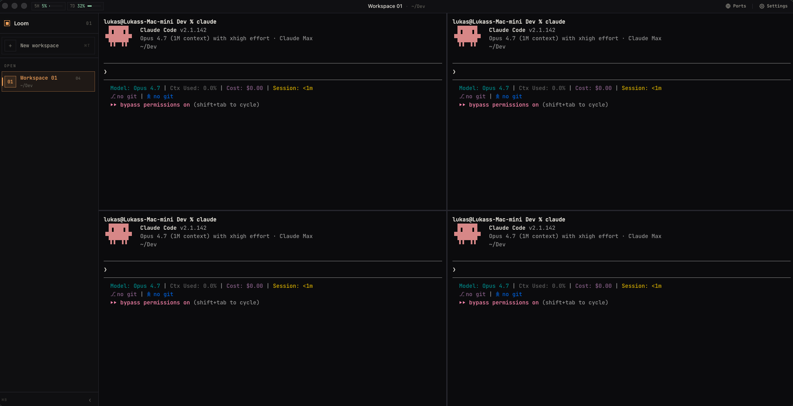
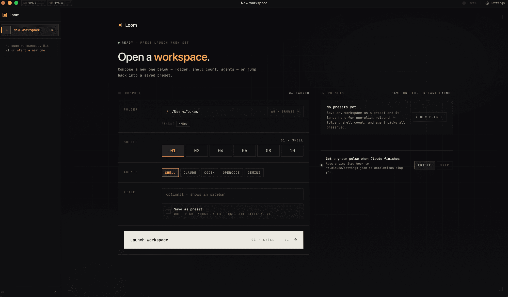

<div align="center">



# Loom

**Parallel coding-agent shells, woven into one window.**

Open a folder. Spin up as many terminals as you want — Claude, Codex,
OpenCode, Gemini, Grok, or any command — and let them work side-by-side.
Save the layout as a preset. Relaunch the whole thing with one click.

Local-first. No account. No telemetry. No cloud.

<p>
  
  
  
  
  
</p>

<sub>

[Why](#why) · [Features](#features) · [Install](#install) · [Architecture](#architecture) · [Status](#status) · [License](#license)

</sub>

</div>

<br />

<div align="center">



<sub>Four agent shells in one workspace. Each pane is its own PTY with its own command, scrollback, and environment.</sub>

</div>

<br />

<div align="center">



<sub>Compose a workspace: pick a folder, a shell count, an agent. Save it as a preset for one-click relaunch.</sub>

</div>

<br />

## Why

When you're juggling agents across a codebase — one on the frontend, one
fixing a flaky test, one writing migrations — switching tabs and terminal
windows burns minutes per task. Loom puts every agent in **one** window,
anchored to the project folder, each pane with its own command, environment,
and scrollback.

Think of each pane as a thread. Loom weaves them.

## Features

<table>
<tr>
<td width="50%" valign="top">

#### Multi-pane workspaces

Each workspace is a folder; each pane is a PTY-backed terminal with its own
command, cwd, and env. Tab them or tile them.

</td>
<td width="50%" valign="top">

#### Presets

Save the *"three Claudes against this monorepo, one shell for the dev
server"* setup. One click relaunches the entire layout.

</td>
</tr>
<tr>
<td valign="top">

#### Resume agent sessions across restarts

Loom captures the session ID via an OSC marker emitted by each
agent's Stop / SessionStart hook. Quit the app, reopen — your
conversation continues mid-stream: `claude --resume <id>`,
`codex resume <id>`, or `gemini --resume <id>` depending on the
agent. The flag is spliced at spawn time, never baked into the
saved command, so a fresh capture after `/clear` always wins.

</td>
<td valign="top">

#### Dev-server preview built in

Run `bun run dev` in a pane; Loom catches the localhost URL the moment it
prints, HEAD-probes for readiness, and opens an iframe preview with
desktop / tablet / mobile viewports.

</td>
</tr>
<tr>
<td valign="top">

#### Local-only by design

Workspaces, presets, sessions, hooks — everything lives on your machine in
`localStorage` and `~/.loom`. No login. No telemetry. No remote calls,
ever.

When you opt in to per-agent completion notifications, Loom writes a
small Loom-marked Stop / SessionStart hook into `~/.claude`, `~/.codex`,
or `~/.gemini` (your choice, per agent). Consent is recorded in
`~/.loom/hooks.json`.

</td>
</tr>
</table>

## Install

> Loom is build-from-source today. macOS is the daily-driver target; Linux
> builds via the same Tauri stack. Prebuilt binaries aren't shipped yet —
> when they are, they'll appear on the [Releases](https://github.com/lukazbaum/loom-terminal/releases) page.

**Prerequisites**

- [Rust toolchain](https://rustup.rs) (stable)
- [Bun](https://bun.sh)
- Platform deps for Tauri 2 — see the [Tauri prerequisites guide](https://tauri.app/start/prerequisites/)

**Run from source**

```sh
git clone https://github.com/lukazbaum/loom-terminal
cd loom
bun install
bun run tauri dev
```

**Build a release bundle**

```sh
bun run tauri build
```

`.dmg` / `.app` / `.AppImage` / `.msi` artifacts land in
`apps/desktop/src-tauri/target/release/bundle/`. Bundles are not yet
code-signed or notarized — macOS will Gatekeeper-block them until you
allow the binary from System Settings → Privacy & Security.

## Architecture

```
apps/desktop/
├── src/                   React 19 + Tailwind 4 frontend (xterm.js terminals)
└── src-tauri/
    └── src/
        ├── pty/            Pane lifecycle, split by concern:
        │   ├── spawn.rs       types + spawn_terminal + rollback helper
        │   ├── reader.rs      per-pane reader thread + chunk processor
        │   ├── probe.rs       dev-server URL HEAD probe
        │   └── commands.rs    write/resize/snapshot/kill/restart commands
        ├── pty_buffer.rs   4 MiB ring buffer + OSC-9 marker scanner
        ├── port_detect.rs  Dev-server URL detection from PTY output
        ├── hook*.rs        Per-agent Stop / SessionStart hooks (Claude,
        │                   Codex, Gemini) with opt-in consent stored in
        │                   ~/.loom/hooks.json
        ├── usage_poller.rs Claude usage / rate-limit polling
        └── lib.rs          Tauri commands + AppState
```

A single Rust process owns every PTY. The React frontend talks to it over
Tauri IPC.

**Tech.** Tauri 2 · Rust · React 19 · TypeScript · Tailwind 4 · xterm.js · portable-pty

## Status

Pre-1.0. The terminal, preset, port-detection, and Claude-resume paths
are stable enough for daily use; in-app settings, packaging, and UI polish
are still moving fast.

<table>
<tr>
<td width="50%" valign="top">

**Shipped**

- Multi-pane workspaces · presets · custom themes
- Agent session resume (Claude, Codex, Gemini)
- Per-agent Stop / SessionStart hook installer with opt-in consent
- Dev-server port detection + iframe preview
- 4 MiB-per-pane ring buffer scrollback
- Per-pane environment overrides
- In-app settings (font size, idle window, themes, keyboard shortcut overview)

</td>
<td width="50%" valign="top">

**Not yet**

- Keyboard shortcut rebinding (the overview's read-only today)
- Standalone CLI for headless workspace launch
- Full-text search over pane scrollback
- Signed / notarized binaries (`bun run tauri build` works; Gatekeeper / SmartScreen flag the result)

</td>
</tr>
</table>

See [`docs/feature-inventory.md`](docs/feature-inventory.md) for the precise,
file-and-line-cited list of what's wired up today.

## Contributing

Issues and PRs welcome. Start with [`CONTRIBUTING.md`](CONTRIBUTING.md);
build instructions are in the [Install](#install) section above and
[`docs/feature-inventory.md`](docs/feature-inventory.md) maps the
current surface area, file-by-file.

One command runs everything CI runs locally — biome (format + lint),
the frontend test suite (`bun test`), `tsc && vite build`,
`cargo fmt --check`, `cargo clippy --all-targets -- -D warnings`,
and `cargo test --all-targets`:

```sh
bun run check
```

Today: 118 Rust unit tests + 30 frontend tests.

## License

[MIT](LICENSE).

<br />

<div align="center">
<sub>Built with care for engineers who run more than one agent at a time.</sub>
</div>
